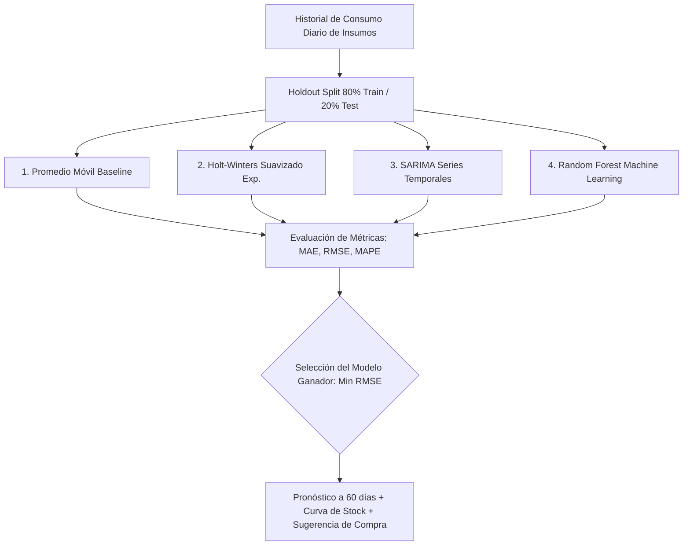
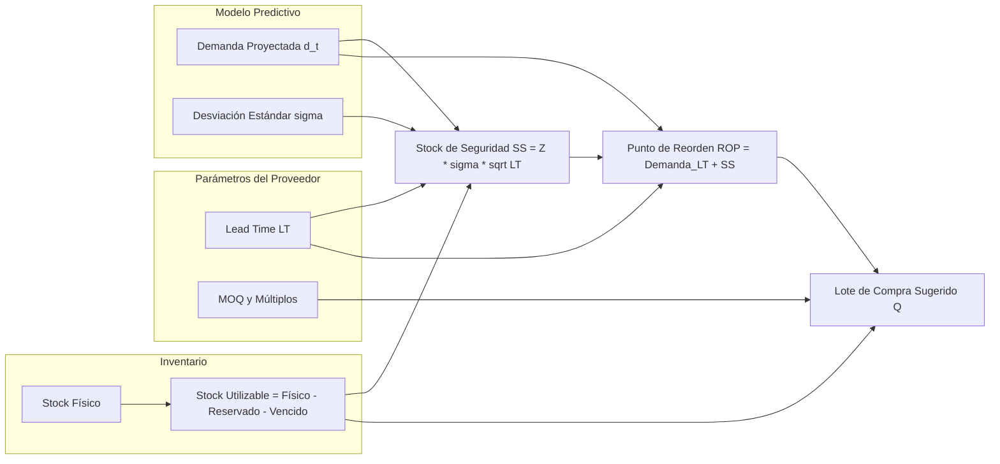
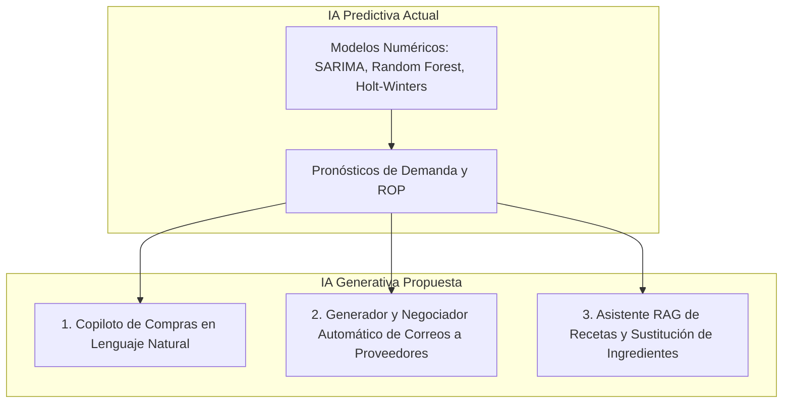

# 📘 Guía Completa de Sustentación y Exposición Técnica: OperaStock
> **Sistema Inteligente de Gestión de Inventarios, Producción y Aprovisionamiento Predictivo con Modelos de Machine Learning y Series Temporales**

---

## 🎯 1. Resumen Ejecutivo del Sistema (¿Qué es OperaStock y qué problema resuelve?)

### El Problema de Negocio
En las empresas de manufactura y alimentos (como una fábrica de galletas/panadería), la gestión de inventarios sufre dos grandes riesgos costosos:
1. **Quiebre de Stock (Stockout):** Quedarse sin una sola materia prima (ej. Harina o Azúcar) detiene toda la planta de producción, generando pérdidas operativas y pedidos insatisfechos.
2. **Sobre-stock y Mermas (Overstock):** Comprar insumos en exceso incrementa costos de almacenamiento, congela capital de trabajo y eleva el riesgo de vencimiento o deterioro.

### La Solución OperaStock
**OperaStock** es una plataforma integral desarrollada en **Django (Python)** que automatiza la trazabilidad desde la orden de producción hasta la compra inteligente de materias primas mediante:
- **Trazabilidad Dual:** Control en masa bruta (*kilos bulk*) y paquetes/unidades terminadas.
- **Explosión de Materiales (BOM / Recetas):** Deducción automática y exacta de ingredientes al producir.
- **Motor Predictivo Multimodelo:** Evaluación simultánea y automática de **4 algoritmos matemáticos y de Machine Learning** para proyectar la demanda a 60 días.
- **Aprovisionamiento Dinámico:** Cálculo automático de **Punto de Reorden (ROP)**, **Stock de Seguridad ($SS$)** y **Lote de Compra ($Q$)** considerando el tiempo de entrega (*Lead Time*), pedido mínimo (*MOQ*) y lotes de empaque de los proveedores.

---

## 🔬 2. Los 4 Modelos Predictivos: Fundamento Teórico y Matemático

El sistema entrena y valida en paralelo 4 modelos usando un esquema **Holdout Cronológico (80% entrenamiento / 20% prueba)**. El sistema descarta el sobreajuste y selecciona automáticamente como *ganador* al modelo que obtenga el menor error cuadrático (**RMSE**) y menor error absoluto (**MAE**).

---

### Modelo 1: Promedio Móvil (Moving Average - Baseline)
* **¿Qué es?** Es el modelo de referencia estadístico más directo. Calcula la media aritmética del consumo en una ventana deslizante de los últimos $k$ días (en OperaStock, $k=7$ días).
* **Fórmula:**
  $$\hat{y}_{t+1} = \frac{1}{k} \sum_{i=0}^{k-1} y_{t-i}$$
* **Variables:**
  - $\hat{y}_{t+1}$: Consumo pronosticado para el día siguiente.
  - $k$: Tamaño de la ventana de análisis (7 días).
  - $y_{t-i}$: Consumo real observado en los días previos.
* **Ventajas:** Extremadamente rápido de calcular, insensible a fallas de convergencia.
* **Cuándo es útil:** Como línea base (*baseline*) para verificar si los modelos avanzados realmente aportan mayor precisión.

---

### Modelo 2: Holt-Winters (Triple Exponential Smoothing)
* **¿Qué es?** Modelo clásico de series temporales que descompone la demanda en tres componentes: **Nivel ($L_t$)**, **Tendencia ($b_t$)** y **Estacionalidad ($S_t$)**.
* **Fórmulas del Modelo Aditivo (Periodo $m=7$ días):**
  $$\text{Nivel: } L_t = \alpha (y_t - S_{t-m}) + (1 - \alpha)(L_{t-1} + b_{t-1})$$
  $$\text{Tendencia: } b_t = \beta (L_t - L_{t-1}) + (1 - \beta)b_{t-1}$$
  $$\text{Estacionalidad: } S_t = \gamma (y_t - L_t) + (1 - \gamma)S_{t-m}$$
  $$\text{Pronóstico a } h \text{ pasos: } \hat{y}_{t+h} = L_t + h \cdot b_t + S_{t+h-m}$$
* **Variables y Parámetros:**
  - $\alpha, \beta, \gamma \in [0, 1]$: Factores de suavizado para el nivel, tendencia y estacionalidad.
  - $m=7$: Ciclo estacional semanal (lunes a domingo).
  - $h$: Horizonte de pronóstico en días ($h = 1, 2, \dots, 60$).
* **Ventajas:** Excelente para capturar patrones semanales (ej. mayor producción viernes y sábados) y tendencias crecientes o decrecientes de ventas.

---

### Modelo 3: SARIMA (Seasonal AutoRegressive Integrated Moving Average)
* **¿Qué es?** El modelo econométrico y probabilístico por excelencia para series temporales con autocorrelación y estacionalidad. Se parametriza como **$\text{SARIMA}(p,d,q) \times (P,D,Q)_s$**.
  - En OperaStock: $(1,1,1) \times (1,0,1)_7$.
* **Ecuación General:**
  $$\Phi_P(B^s)\phi_p(B)(1 - B)^d(1 - B^s)^D y_t = \Theta_Q(B^s)\theta_q(B)\varepsilon_t$$
* **Variables y Operadores:**
  - $B$: Operador de retardo (*Backshift operator*, donde $B^k y_t = y_{t-k}$).
  - $\phi_p(B)$: Polinomio autorregresivo no estacional (dependencia del consumo de días anteriores).
  - $\theta_q(B)$: Polinomio de medias móviles (dependencia de los errores de pronóstico pasados).
  - $\Phi_P(B^s), \Theta_Q(B^s)$: Términos autorregresivos y de media móvil estacionales (ciclos de $s=7$ días).
  - $d, D$: Grados de diferenciación para estabilizar la media y eliminar no-estacionariedad.
  - $\varepsilon_t$: Ruido blanco gaussiano con media 0.
* **Ventajas:** Muy robusto para modelar correlaciones temporales complejas y variabilidad cíclica.

---

### Modelo 4: Random Forest Regressor (Machine Learning Basado en Árboles)
* **¿Qué es?** Ensamble de aprendizaje supervisado no lineal basado en múltiples árboles de decisión (*Decision Trees*) con técnicas de *Bagging* y selección aleatoria de características.
* **Ingeniería de Características (*Feature Engineering*) en OperaStock:**
  El sistema transforma la serie temporal unidimensional en una matriz tabular de variables predictoras:
  - **Retardos (*Lags*):** $y_{t-1}, y_{t-7}, y_{t-14}, y_{t-30}$ (consumos históricos hace 1, 7, 14 y 30 días).
  - **Medias Móviles:** Promedios rodantes de 7, 14 y 30 días.
  - **Volatilidad Rodante:** Desviación estándar de 7 y 30 días.
  - **Variables Calendáricas:** Día de la semana, día del mes, semana del año, mes y trimestre.
  - **Tendencia de Consumo:** Diferencial $\text{Media}_7 - \text{Media}_{30}$.
* **Fórmula de Predicción del Ensamble:**
  $$\hat{y}_t = \frac{1}{N} \sum_{i=1}^{N} T_i(x_t)$$
  donde $N=100$ árboles y $T_i(x_t)$ es la predicción del $i$-ésimo árbol.
* **Ventajas:** Captura relaciones no lineales complejas, interacciones entre factores calendáricos y picos atípicos sin asumir normalidad en los datos.

---

## 🧠 3. ¿Cómo Piensa Cada Modelo y Qué Datos Toma? (Explicación en Palabras Directas)

| Algoritmo | ¿Qué datos mira exactamente? | Lógica de cálculo (Cómo piensa) | ¿Por qué y cuándo gana? |
| :--- | :--- | :--- | :--- |
| **1. Promedio Móvil** | Únicamente los últimos **7 días** de consumo. | *«Suma lo consumido en los últimos 7 días y lo divide entre 7. Asume que todos los días siguientes se usará esa misma cantidad fija.»* | Gana en insumos de **consumo plano y constante** que casi no varían (ej. Sal). |
| **2. Holt-Winters** | Todo el historial, dando **más peso a las últimas semanas** y agrupando en ciclos semanales de 7 días (lun a dom). | *«Descompone: Nivel (promedio reciente) + Tendencia (si el negocio crece o baja) + Factor del día (ej. viernes y sábado +40% de demanda, lunes -20%).»* | Gana en insumos con **picos de fin de semana muy marcados** y ritmos semanales claros (ej. Azúcar, Cacao, Mantequilla). |
| **3. SARIMA** | Secuencia histórica completa buscando **ondas y autocorrelación** (cómo hoy depende de ayer y de la semana pasada). | *«Calcula la 'memoria' del consumo y corrige sus errores pasados: si subestimó un miércoles previo, ajusta hacia arriba el siguiente miércoles.»* | Gana en insumos de **alto volumen y consumo ondulante** continuo (ej. Harina de Trigo, Leche en polvo, Miel). |
| **4. Random Forest** | Transforma fechas en pistas: • Lags: 1, 7, 14, 30 días • Promedios rodantes • Día de semana, quincena y mes | *«Crea 100 árboles de decisión independientes que hacen preguntas lógicas cruzadas y promedian sus 100 respuestas para dar la cifra final.»* | Gana en insumos con **comportamientos complejos y no lineales** (picos por quincenas o patrones que no siguen fórmulas simples). |

---

## 📊 4. Métricas de Evaluación de Modelos (¿Cómo sabe el sistema cuál es el mejor?)

Para cada uno de los 4 modelos, se calculan las siguientes métricas sobre el conjunto de validación de prueba:

### 1. MAE (Mean Absolute Error - Error Absoluto Medio)
$$\text{MAE} = \frac{1}{n}\sum_{t=1}^{n} |y_t - \hat{y}_t|$$
- **Significado:** Promedio en kilos de cuánto se desvía la predicción del valor real en magnitud absoluta.

### 2. RMSE (Root Mean Squared Error - Raíz del Error Cuadrático Medio)
$$\text{RMSE} = \sqrt{\frac{1}{n}\sum_{t=1}^{n} (y_t - \hat{y}_t)^2}$$
- **Significado:** Penaliza fuertemente los errores grandes. **Es la métrica primaria con la que OperaStock selecciona al modelo ganador**.

### 3. MAPE (Mean Absolute Percentage Error - Error Porcentual Absoluto Medio)
$$\text{MAPE} = \frac{100\%}{n}\sum_{t=1}^{n} \left| \frac{y_t - \hat{y}_t}{y_t} \right| \quad (y_t \neq 0)$$
- **Significado:** Porcentaje de error promedio relativo al volumen de consumo.

---

## 📦 5. Fórmulas de Cadena de Suministro y Gestión de Inventarios

Una vez que el mejor modelo pronostica la demanda futura diaria ($\hat{d}_1, \hat{d}_2, \dots, \hat{d}_{60}$), el motor de aprovisionamiento ([inventario/procurement.py](file:///c:/Users/Misael/Desktop/AppGestion/inventario/procurement.py)) ejecuta las siguientes fórmulas estandarizadas:

---

### A. Stock de Seguridad ($SS$ - Safety Stock)
El inventario de reserva que protege a la empresa contra variaciones inesperadas de demanda o retrasos del proveedor:
$$SS = Z \cdot \sigma_d \cdot \sqrt{LT}$$
* **Significado de cada variable:**
  - $Z$: Factor de servicio según el nivel de confianza configurado (para $95\%$ de nivel de servicio, $Z = \text{inv\_cdf}(0.95) \approx 1.645$).
  - $\sigma_d$: Desviación estándar del consumo diario histórico.
  - $LT$: *Lead Time* o tiempo de entrega del proveedor en días hábiles.
  - $\sqrt{LT}$: Factor de amortiguación temporal de la incertidumbre.

---

### B. Demanda Durante el Tiempo de Entrega ($\text{Demanda}_{LT}$)
Cantidad de insumo que la fábrica consumirá mientras espera que el proveedor entregue el pedido:
$$\text{Demanda}_{LT} = \sum_{t=1}^{LT} \hat{y}_t$$

---

### C. Punto de Reorden ($ROP$ - Reorder Point)
Es el umbral crítico de inventario: si el stock utilizable cae por debajo de este valor, se debe disparar una orden de compra inmediatamente.
$$ROP = \text{Demanda}_{LT} + SS = \left(\sum_{t=1}^{LT} \hat{y}_t\right) + \left(Z \cdot \sigma_d \cdot \sqrt{LT}\right)$$

---

### D. Nivel Objetivo de Cobertura ($S$) y Lote Óptimo de Compra ($Q$)
Calcula cuánto material pedir para cubrir la producción durante el tiempo de entrega más el horizonte de cobertura deseado (ej. 30 días de producción):
$$S = \left(\sum_{t=1}^{LT + \text{Cobertura}} \hat{y}_t\right) + SS$$
$$\text{Posición Cobertura} = \text{Stock Utilizable} + \text{Entradas en Tránsito Oportunas}$$
$$Q_{\text{bruto}} = \max(0, S - \text{Posición Cobertura})$$

**Ajuste a Reglas de Negocio del Proveedor (MOQ y Múltiplos de Empaque):**
$$Q = \left\lceil \frac{\max(Q_{\text{bruto}}, MOQ)}{\text{Múltiplo}} \right\rceil \times \text{Múltiplo}$$
* **Variables:**
  - $MOQ$ (*Minimum Order Quantity*): Cantidad mínima que exige el proveedor (ej. mínimo 25 kg).
  - $\text{Múltiplo}$: Presentación del bulto/saco (ej. sacos de 5 kg o 25 kg).

---

## 🛠️ 6. Flujo Operativo Completo en OperaStock

| Módulo | Acción en el Sistema | Resultado Técnico en BD |
| :--- | :--- | :--- |
| **1. Recetas / BOM** | Creación de productos y porcentajes de insumos por kg. | Registrado en `DetalleProducto` y `FormulaProducto`. |
| **2. Producción** | Operador ingresa producto, kilos bulk (ej. 10 kg) y unidades terminadas (ej. 150 uds). | Registra `Produccion`, descuenta stock de materias primas con `ConsumoMateriaPrima` y audita movimientos. |
| **3. Machine Learning** | Simulación de consumos diarios y entrenamiento cronológico. | Genera `Entrenamiento`, artefactos `.joblib`, comparación de métricas y selecciona el mejor modelo. |
| **4. Pronóstico** | Generación de curva de demanda a 60 días. | Genera `Pronostico` con consumos día a día. |
| **5. Sugerencias** | Análisis automático de $SS$, $ROP$, $LT$ y precios de proveedores. | Genera registros `SugerenciaCompra` en estado `PENDIENTE`. |
| **6. Compras** | Aprobación/edición de sugerencias con un clic. | Genera `OrdenCompra` en estado `EN_TRANSITO` y actualiza inventario al recibir lotes. |

---

## 🚀 7. ¿Qué más se puede agregar al proyecto? (Puntos Extra para la Exposición)

Si el profesor pregunta cómo escalar o enriquecer el proyecto en una versión 2.0:

1. **Gestión de Lotes y Vencimientos FEFO (*First Expired, First Out*):**
   - El sistema ya tiene modelos base de `LoteMateriaPrima`. Se puede expandir el algoritmo para sugerir compras preventivas de insumos que vencen en los próximos 15 días.
2. **Matriz de Costeo en Tiempo Real (Cost of Goods Sold - COGS):**
   - Calcular el costo exacto por cada galleta/unidad individual producida en función del precio de compra ponderado del lote de cada insumo.
3. **Planificador Maestro de Producción (MPS / MRP II):**
   - Módulo que reciba órdenes de venta de clientes y programe automáticamente el calendario semanal de horneado según la capacidad de los hornos.
4. **Exportación de Órdenes en PDF con Código QR:**
   - Generación automática de órdenes de compra listas para enviar por WhatsApp o correo al proveedor con un enlace de confirmación.

---

## 🤖 8. Evaluación: ¿Se puede integrar Inteligencia Artificial Generativa / LLMs?

¡Totalmente sí! Aquí tienes 3 casos de uso de **IA Generativa / LLMs (como GPT-4 o Gemini)** que complementarían el Machine Learning predictivo existente:

### Caso 1: Asistente / Copiloto de Abastecimiento (Chatbot con Function Calling)
* **Cómo funcionaría:** El gerente de compras puede preguntar en lenguaje natural:
  > *"¿Qué materias primas están en riesgo de agotarse antes del viernes y a qué proveedor me conviene pedirle?"*
* **Implementación:** Un agente que ejecuta consultas SQL/ORM sobre los pronósticos y devuelve un resumen ejecutivo conversacional.

### Caso 2: Redacción Automatizada de Pedidos y Cotizaciones
* **Cómo funcionaría:** Al aprobar una sugerencia de compra, un LLM genera automáticamente la orden formal en PDF y el cuerpo del correo/WhatsApp personalizado para el proveedor con tono profesional.

### Caso 3: Asistente de Reformulación y Sustitución de Insumos (RAG)
* **Cómo funcionaría:** Si hay escasez total de un insumo (ej. Cacao en polvo o Harina de Trigo), el LLM puede analizar la receta y sugerir alternativas de reemplazo proporcionales (ej. Harina de Avena + modificador de textura) manteniendo el rendimiento por kilo.

---

## 📝 9. Guion Rápido de 3 Minutos para Exponer al Profesor

> **"Buenos días, profesor. Nuestro proyecto es OperaStock, un sistema inteligente de gestión de producción y aprovisionamiento predictivo.**
>
> **1. El Reto:** En las empresas de alimentos, quedarse sin insumos paraliza la fábrica, pero comprar de más genera mermas por vencimiento.
>
> **2. Lo que hace el sistema:** Registramos las producciones tanto en kilos de masa como en unidades empaquetadas. Cada vez que se produce, el sistema descuenta automáticamente los insumos según la fórmula o receta (BOM).
>
> **3. El Corazón Predictivo:** En lugar de usar un promedio simple, el sistema entrena y evalúa en paralelo **4 modelos:** *Promedio Móvil, Holt-Winters con estacionalidad semanal, SARIMA y Random Forest con ingeniería de retardos*. Sobre un conjunto de prueba del 20%, el sistema calcula el error **MAE y RMSE** y selecciona de forma automática el modelo más exacto para cada ingrediente.
>
> **4. Decisión de Compra:** Con el pronóstico a 60 días, el sistema aplica las fórmulas de **Punto de Reorden (ROP)** y **Stock de Seguridad**, cruza los tiempos de entrega (*Lead Time*) y cantidades mínimas (*MOQ*) de los proveedores registrados, y genera automáticamente las **Sugerencias de Compra** que el administrador puede revisar, editar y aprobar con un solo clic.
>
> **En resumen:** Es una solución que une la gestión operativa diaria con Machine Learning y logística avanzada para tomar decisiones de compra basadas en datos reales."

---
*Documento generado para OperaStock — 2026*
